<p align="center">
  <picture>
    <source media="(prefers-color-scheme: dark)" srcset="documentation/assets/branding/samaris-logo.webp">
    
  </picture>
</p>

<div align="center">

# SAMARIS OS

## **Mountain Lake — Alpha One**

### *The Native WebOS*

**Bootable. Performant. Beautiful.**  
**In your pocket.**

</div>

<p align="center">
  <a href="https://samaris.tech">🌐 Website</a> ·
  <a href="documentation/docs/index.md">📚 Documentation</a> ·
  <a href="documentation/docs/quickstart.md">🚀 Quickstart</a> ·
  <a href="documentation/ROADMAP.md">🗺️ Roadmap</a> ·
  <a href="documentation/CHANGELOG.md">📝 Changelog</a>
</p>

<p align="center">
  
  
  
  
  
  
  
</p>

> ⚡ **Public Alpha** — a working, bootable Native WebOS prototype. VM-tested and booted on a Mac Mini Late 2012 in around 40 seconds. Ready for exploration.

---

## 🧠 Abstract

**Samaris OS** is a bootable operating system where the desktop experience is built entirely with web technologies — but runs as a first-class native environment inside a real OS, not inside a browser tab.

Linux underneath.  
Web technologies on top.  
Native OS behaviour in between.

This is not a website. Not a mockup. Not a Linux rice.

**This is a working operating system that boots from a USB key, launches a full graphical desktop, runs native apps, connects to WiFi, persists sessions, and hosts a fully local AI assistant — all in around 5 GB for x86-64, or 10.68 GB for the universal x86-64 + ARM image.**

**And YES, it even runs DOOM.**

---

## 📑 Table of Contents

- [What Is Samaris OS?](#-what-is-samaris-os)
- [Videos](#-videos)
- [Screenshots](#️-screenshots)
- [The Vision](#-the-vision)
- [Architecture](#️-architecture)
- [Key Capabilities](#-key-capabilities)
- [Built-in Applications](#-built-in-applications)
- [App Store & Wine](#-app-store--wine--extend-samaris-os)
- [Orbit AI](#-orbit-ai--your-local-brain)
- [Performance](#-performance)
- [Download](#️-download)
- [Try It](#-try-it)
- [What Samaris OS Is Not](#-what-samaris-os-is-not)
- [Built By](#-built-by)
- [License](#️-license)

---

## 🔥 What Is Samaris OS?

Samaris OS is a bootable operating environment that starts directly into a custom native desktop.

**This is not a website.**  
**Not a mockup.**  
**Not a browser tab.**  
**Not a Linux rice.**

Samaris OS boots. It launches its own graphical experience. It runs a custom desktop shell. It opens apps. It manages windows. It persists sessions. It manages files. It runs system services. It talks to AI.

**It behaves like a real operating environment.**

```txt
Linux kernel → systemd → Node.js bridge → Rust accelerator → Electron shell → React desktop
```

Alpha One is the first public step.

---

## 🎬 Videos

### Samaris OS Alpha One — Demo

<p align="center">
  <a href="https://youtu.be/Xw4GVZJRr_k">
    
  </a>
</p>

<p align="center">
  <em>Boot → desktop → apps → Orbit AI. See the full experience in action.</em>
</p>

<br>

### Samaris OS Alpha One — Proof of Boot

<p align="center">
  <a href="https://youtu.be/XRXPSZpSBPI">
    
  </a>
</p>

<p align="center">
  <em>Mac Mini Late 2012 Intel · Boot → Onboarding → Desktop</em>
</p>

---

## 🖼️ Screenshots

<p align="center">
  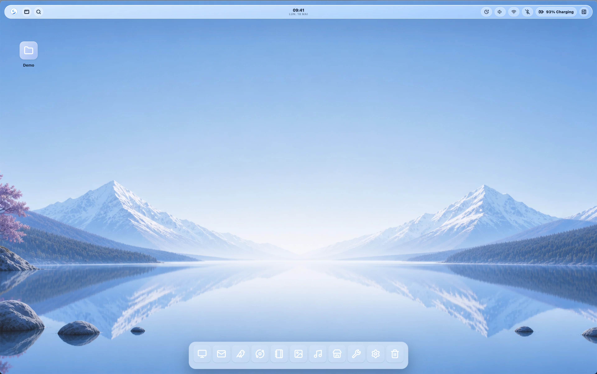
  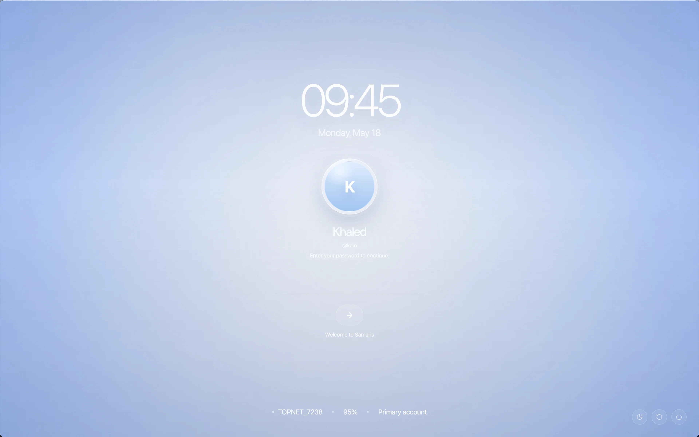
</p>

<p align="center">
  <em>The Samaris desktop and lock screen — fullscreen Electron shell with glass-design UI.</em>
</p>

<p align="center">
  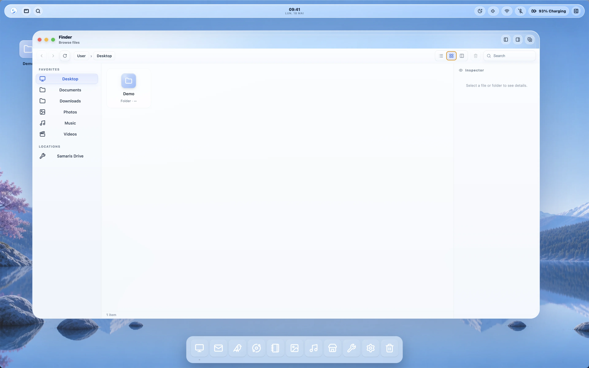
  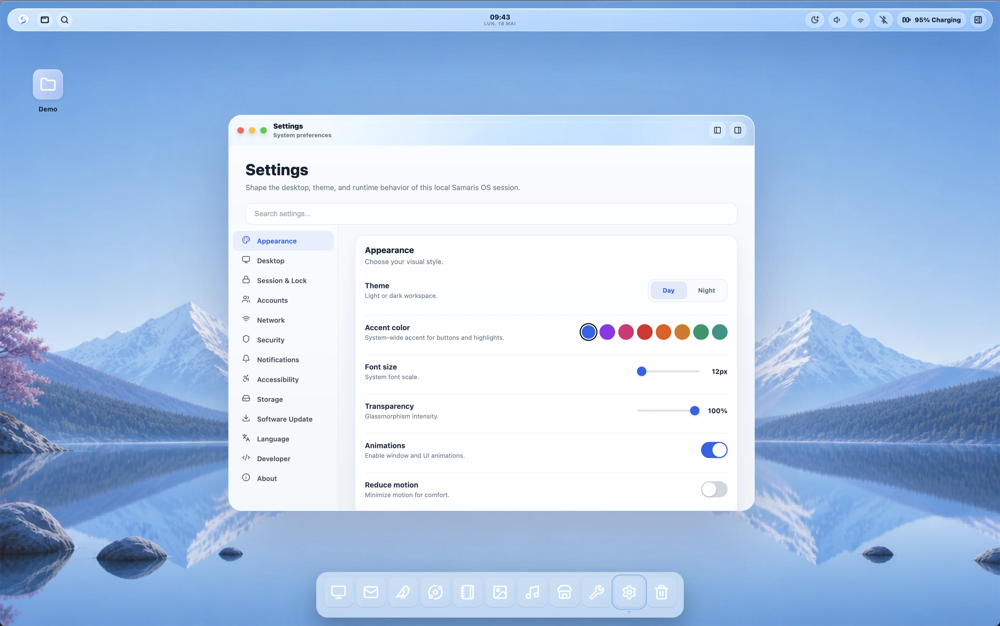
  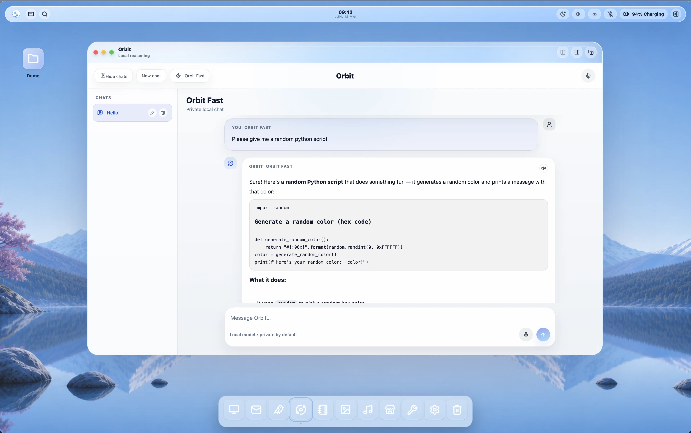
</p>

<p align="center">
  <em>Finder filesystem browser · System Settings · Orbit AI assistant</em>
</p>

<p align="center">
  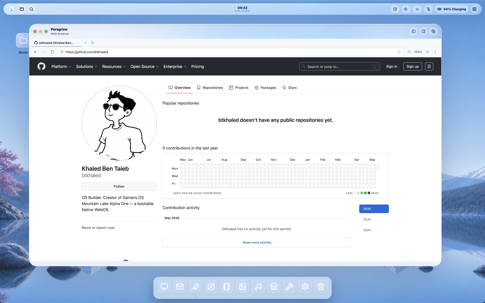
  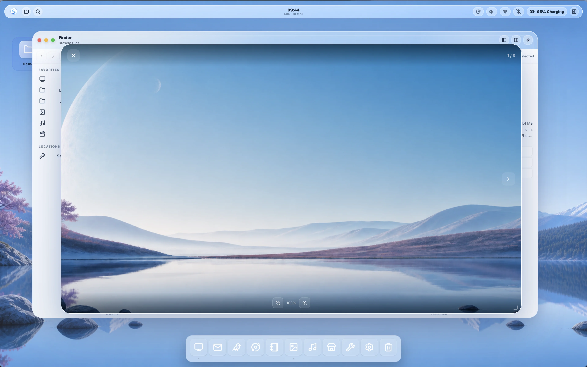
  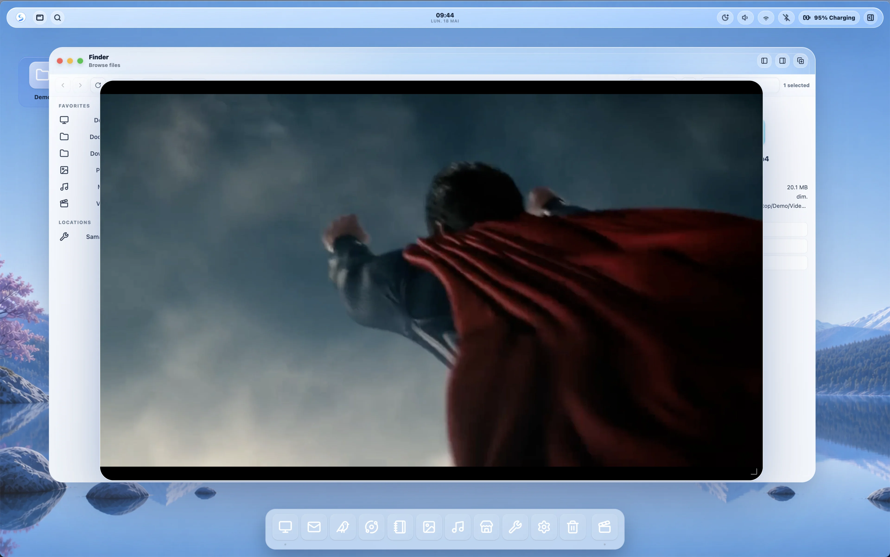
</p>

<p align="center">
  <em>Peregrine web browser · Photos · Videos player</em>
</p>

<p align="center">
  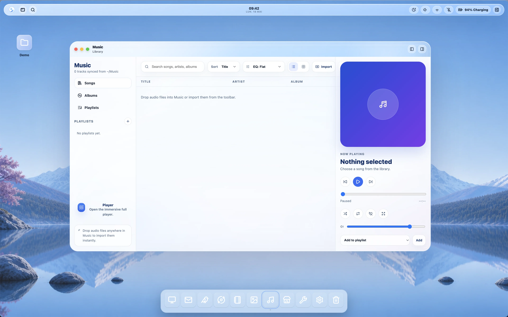
  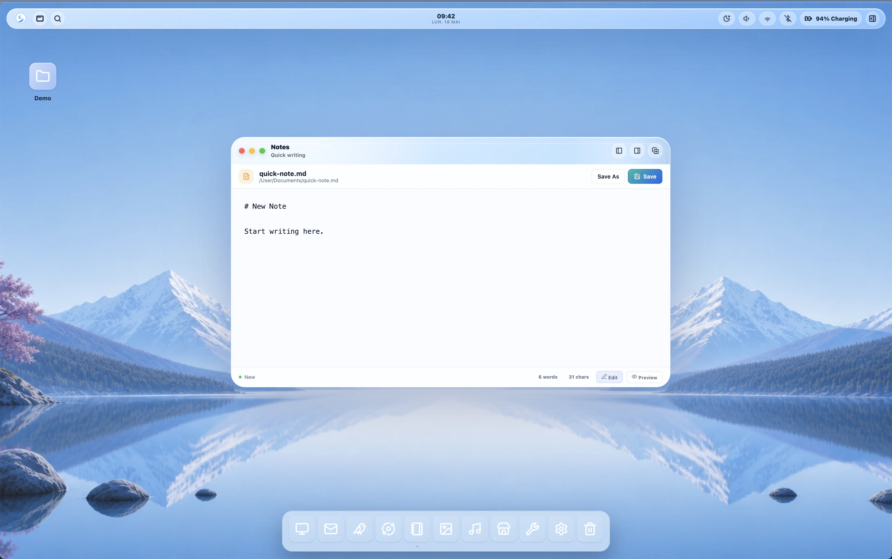
  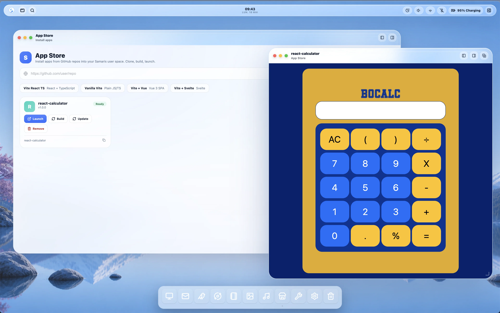
</p>

<p align="center">
  <em>Music player · Notes · App Store with community apps</em>
</p>

---

## 🌌 The Vision

Modern computing has become dependent on accounts, subscriptions, cloud lock-in, fragmented ecosystems, heavy desktop environments, and impersonal interfaces.

**Samaris OS explores another direction.**

A portable operating environment that boots from a USB key, opens into its own fullscreen desktop, keeps your session persistent across reboots, and gives you a beautiful, local-first workspace — all running on commodity hardware.

No mandatory cloud.  
No forced account.  
No telemetry-first design.  
No bloated ecosystem.

> **Your desktop. Your files. Your apps. Your environment. In your pocket.**

---

## 🏗️ Architecture

```txt
┌──────────────────────────────────────────────────────────────────┐
│ LAYER 6: APPLICATIONS                                            │
│ 26 built-in apps · Wine · Orbit AI · Web Apps · jsdos            │
├──────────────────────────────────────────────────────────────────┤
│ LAYER 5: DESKTOP SHELL                                           │
│ Electron 28 · React 18 FSD · Window Manager · AirBar · Dock      │
├──────────────────────────────────────────────────────────────────┤
│ LAYER 4: KERNEL A — Node.js (:9999)                              │
│ 33 system services · WebSocket router · Auth · IPC · Volt Unifier│
├──────────────────────────────────────────────────────────────────┤
│ LAYER 3: VOLT RUNTIME — Rust Daemons (SBP binary protocol)       │
│ VRM (RAM) · VGM (GPU) · VUM (USB) · DWP (Scheduler) · ASC (HW)   │
│                         Tesseract Engine (Kernel B)              │
├──────────────────────────────────────────────────────────────────┤
│ LAYER 2: INIT & BOOT                                             │
│ systemd · Plymouth splash · OverlayFS · Live filesystem          │
├──────────────────────────────────────────────────────────────────┤
│ LAYER 1: DEBIAN TRIXIE BASE                                      │
│ Linux 6.12 · WiFi/BT/GPU firmware · X.Org · NetworkManager       │
└──────────────────────────────────────────────────────────────────┘
```

The operating system is built from a modular ISO pipeline:

```txt
debootstrap → Debian packages → module overlays → Rust daemons → Node.js kernel → Electron shell → React desktop
```

All compressed into a single SquashFS filesystem inside a bootable ISO.

[Full architecture documentation →](documentation/docs/architecture/overview.md)

---

## ✨ Key Capabilities

### 🚀 1. Native Boot — Real OS, Real Hardware

From a USB key or ISO, Samaris boots directly into its own fullscreen desktop.

No cloud streaming.  
No virtual machine required.  
No browser dependency.

The live filesystem uses OverlayFS for persistence, allowing the user session to survive reboots.

> **Boot time:** around 47 seconds in QEMU  
> **Hardware boot:** around 40 seconds on Mac Mini Late 2012 Intel

---

### 🧬 2. Dual-Kernel Architecture

| Kernel | Language | Role |
|---|---:|---|
| **Kernel A** | Node.js | Central WebSocket server on `:9999`; manages filesystem, WiFi, Bluetooth, audio, battery, AI, sessions, permissions, encryption, firewall, mail, printing, and more |
| **Kernel B** | Rust | Native acceleration daemon; SBP v5 binary protocol, priority scheduler, thermal watchdog, GPU canvas, compute bridge, and security sandbox |

The two kernels communicate through **Volt Unifier**, which bridges desktop events to SBP binary messages through bridge modules and IPC clients.

[Kernel A →](documentation/docs/architecture/kernel-node.md) · [Kernel B →](documentation/docs/modules/daemons/kernel-b.md) · [Volt Unifier →](documentation/docs/architecture/volt-unifier.md)

---

### 🦀 3. Six Native Rust Daemons

Every major system resource is managed by a dedicated Rust daemon communicating through the SBP binary protocol.

| Daemon | Role | Key Features |
|---|---|---|
| **VRM** | RAM Manager | 3-tier memory, ZSTD + LZ4 compression, SHA-256 deduplication, pressure zones |
| **VGM** | GPU Manager | Wgpu, Vulkan, Metal backends, VRAM tiering, shader cache, thermal watchdog |
| **VUM** | USB Manager | RAM-first FUSE filesystem, WAL journal, CRC32, I/O scheduler, safe eject |
| **DWP** | Worker Pool | Adaptive priority scheduler, 5 priority levels, desktop frame guard, Orbit burst control |
| **ASC** | Adaptive Config | Hardware detection at boot, policy compiler, daemon configuration generation |
| **VDM** | Display Manager | xrandr-based detection, hotplug, rollback, safe mode, HiDPI scaling |

[All daemons →](documentation/docs/architecture/volt-daemons.md) · [SBP Protocol →](documentation/docs/apis/sbp-protocol.md)

---

### 🖥️ 4. Desktop Shell — Electron + React 18

The desktop is a fullscreen React application rendered by Electron.

It provides:

- 🪟 **Window Manager** — z-order, resizing, snapping, animations, close guards
- 🧭 **Dock** — application launcher with running indicators
- 📡 **AirBar** — system status panel for clock, WiFi, battery, and volume
- 🔎 **Spotlight Search** — `Cmd/Ctrl + Space` global search
- 🎨 **Theme System** — light/dark mode, accent colours, density, font scale
- 🗂️ **Desktop Icons** — draggable organised grid
- 🔒 **Lock Screen** — authentication overlay

[Desktop architecture →](documentation/docs/architecture/electron-shell.md) · [UI architecture →](documentation/docs/modules/system/ui-architecture.md) · [Window system →](documentation/docs/architecture/window-system.md)

---

### 💾 5. Session Persistence

All user data survives reboots:

- files
- settings
- app state
- credentials
- session metadata

The live system uses an OverlayFS filesystem, while sessions are tracked by `sessionFeaturesService`.

Encrypted user storage is managed through:

```txt
.volt/users/
```

---

## 📦 Built-in Applications

**26 applications** ship with Alpha One, organised into four categories.

### 🧰 System & Desktop

| App | App | App | App | App |
|---|---|---|---|---|
| [Finder](documentation/docs/apps/finder.md) | [Terminal](documentation/docs/apps/terminal.md) | [Settings](documentation/docs/apps/settings.md) | [App Store](documentation/docs/apps/app-store.md) | [Notes](documentation/docs/apps/notes.md) |
| [Text Editor](documentation/docs/apps/text-editor.md) | [Downloads](documentation/docs/apps/downloads.md) | [Trash](documentation/docs/apps/trash.md) | [Utilities](documentation/docs/apps/utilities.md) | [About](documentation/docs/apps/about.md) |

### 🌐 Network & Security

| App | App | App | App |
|---|---|---|---|
| [Network](documentation/docs/apps/network.md) | [Firewall](documentation/docs/apps/firewall.md) | [Encryption](documentation/docs/apps/encryption.md) | [Permissions Manager](documentation/docs/apps/permissions-manager.md) |

### 🎵 Media & Productivity

| App | App | App | App |
|---|---|---|---|
| [Music](documentation/docs/apps/music.md) | [Photos](documentation/docs/apps/photos.md) | [Videos](documentation/docs/apps/videos.md) | [PDF Viewer](documentation/docs/apps/pdf-viewer.md) |
| [Mail](documentation/docs/apps/mail.md) | [Archive](documentation/docs/apps/archive.md) | [Peregrine Browser](documentation/docs/apps/peregrine.md) | [Orbit AI](documentation/docs/apps/orbit.md) |

### 🕹️ Compatibility

| App | Description |
|---|---|
| Wine Launcher | Windows compatibility layer |
| [DOOM](documentation/docs/apps/doom.md) | Runs through jsdos |

---

## 📦 App Store & Wine — Extend Samaris OS

### 🛒 Samaris App Store

The App Store is the simplest way to grow your system. It connects directly to GitHub repositories that publish Samaris-compatible apps.

- **One-click install** from the store interface
- **Community-driven** — anyone can host an app on GitHub
- **No terminal, no dependency hunting** — the store handles cloning, building, and integration
- **Fast iteration** — install apps as quickly as you would preview a React component

The store lists categories such as utilities, media, developer tools, and games. Future versions will support automatic updates.

---

### 🍷 Wine — Windows Compatibility

Wine is integrated at the system level, allowing Samaris OS to run Windows `.exe` applications alongside native Samaris apps.

- **Launch `.exe` files** directly from Finder or the terminal
- **Seamless window management** — Windows apps resize, snap, and focus like native apps
- **No virtual machine required** — Wine runs natively on Samaris OS
- **Compatibility with classic and productivity apps** — older Windows software, utilities, and some games

> 💡 **Note:** Wine is a compatibility layer, not an emulator. Performance and compatibility vary by application.

### Why both?

| System | Purpose |
|---|---|
| **App Store** | Fast, safe, community-built apps |
| **Wine** | Compatibility with existing Windows software |

Together, they make Samaris OS a practical daily environment for exploration without locking the user into a single ecosystem.

[App Store docs →](documentation/docs/apps/app-store.md) · [Wine launcher docs →](documentation/docs/apps/wine-launcher.md) · [Adding an app to the store →](documentation/docs/guides/adding-an-app.md)

---

## 🧠 Orbit AI — Your Local Brain

**No cloud. No accounts. No telemetry. No phone-home.**

Samaris ships with a complete local AI stack running entirely on your hardware, powered by `llama.cpp` with GPU acceleration through Metal, CUDA, or Vulkan.

| Model | Size | Purpose |
|---|---:|---|
| `Qwen3-1.7B-Q8_0.gguf` | 1.7 GB | LLM — conversation, reasoning, code |
| `ggml-small.bin` | 465 MB | Speech-to-text with Whisper |
| `OuteTTS-0.2-500M-Q8_0.gguf` | 512 MB | Text-to-speech |
| `WavTokenizer-Large-75-F16.gguf` | 124 MB | Audio vocoder |

### Voice Mode

```txt
Press mic → speak → Whisper transcribes → Qwen3 generates → OuteTTS speaks → loop
```

Orbit can be interrupted mid-sentence. It stops and responds.

Orbit can be summoned with:

```txt
Cmd/Ctrl + Space
```

It operates with burst priority through the DWP scheduler — a dedicated 100 ms window with 75% worker reservation ensures responsive AI even under load.

[Orbit AI docs →](documentation/docs/apps/orbit.md) · [AI Stack →](documentation/docs/architecture/ai-stack.md)

---

## 📊 Performance

| Metric | Value |
|---|---:|
| **Boot time in QEMU** | **47.0s** |
| Kernel boot | 7.99s |
| Userspace boot | 39.05s |
| `graphical.target` | 38.4s |
| **Memory at idle** | **~715 MB / 7.8 GB** |
| Available RAM | 7.1 GB |
| **Kernel panics** | **0** |
| Failed units | 0 |
| Active VOLT services | 9 |
| **x86-64 FULL ISO** | **5.1 GB** |
| SquashFS filesystem | 4.88 GB |
| **Universal ISO** | **10.68 GB** |

[Full benchmark report →](documentation/assets/benchmarks/iso-boot-qemu.md) · [ISO size breakdown →](documentation/assets/benchmarks/iso-size.md)

---

## ⬇️ Download

<p align="center">
  <strong>Two ISO variants · Free · No account · No telemetry</strong>
</p>

| Variant | Architecture | Size | Download | Description |
|---|---|---:|---|---|
| **Samaris OS Alpha One RC — x86_64 FULL** | x86_64 | 5.1 GB | [Download ISO](https://mega.nz/folder/Vn8WiAyZ#SVgyjxcdnh7eoBdFQiRR9A) | Full desktop experience for Intel/AMD systems with Orbit AI, 26 applications, Electron desktop shell, and 9 native Rust daemons |
| **Samaris OS Alpha One RC — Universal** | x86_64 + aarch64 | 10.68 GB | [Download ISO](https://pub-acdac63983104a13aa0f945384a81f60.r2.dev/Samaris-OS-Alpha-One-RC.iso) | Dual-architecture release containing both Intel/AMD and ARM64 root filesystems in a single bootable image |

<p align="center">
  <a href="https://samaris.tech">
    <strong>Official Website →</strong>
  </a>
</p>

> ℹ️ The Universal ISO includes two complete SquashFS root filesystems:
> one for x86_64 and one for aarch64, allowing the same image to boot on both Intel/AMD and ARM64 systems.

---

## 🧪 Try It

### 1. Download

Get the ISO from:

```txt
https://samaris.tech
```

### 2. Run in QEMU or a Virtual Machine

```bash
qemu-system-x86_64 \
  -m 4096 \
  -smp 4 \
  -cdrom Samaris-OS-Alpha-One-RC.iso \
  -vga virtio \
  -display cocoa
```

### 3. Explore

- 🖥️ **Desktop** — fullscreen shell, dock, window management
- 🗂️ **Finder** — filesystem browser
- ⚙️ **Settings** — theme, appearance, security
- 🧠 **Orbit AI** — `Cmd/Ctrl + Space` to launch the assistant
- 🦅 **Peregrine** — built-in web browser
- 🛒 **App Store** — install apps from GitHub

### System Requirements

| Component | Minimum |
|---|---|
| CPU | 2 cores, x86_64 |
| RAM | 4 GB |
| Storage | 16 GB |
| GPU | Intel HD or basic GPU |

[Quickstart →](documentation/docs/quickstart.md) · [Installing the ISO →](documentation/docs/guides/installing-iso.md) · [First Boot →](documentation/docs/guides/first-boot.md)

---

## ❌ What Samaris OS Is Not

Samaris OS Alpha One is:

- not a finished OS
- not a Windows replacement
- not a macOS replacement
- not a daily-driver recommendation
- not production-ready
- not hardware-certified
- not a traditional Linux desktop distribution
**It is a serious experimental operating system prototype.**

---

## ⚠️ Known Issues (Alpha One)

- WiFi: works on some hardware, not all. Firmware missing for certain chips.
- App Store: works with standard React/Vite GitHub repos. Edge cases in progress.
- Wine: present but not extensively tested. 
- Peregrine downloads: occasional bugs under investigation.

**Alpha Two will address all of the above. And more.**

---

## 👨‍💻 Built By

**Khaled Ben Taieb** — OS Architect

- PharmD, MBA
- Built solo
- Zero budget
- AI-assisted development
- Built in around 1 month
- Development machine: MacBook Air M3

> *"Computers are supposed to be fun. That's why I made you this OS; it's tailored to your taste. Love you, dad."*

---

## ⚖️ License

**Samaris OS** — Copyright © 2026 Khaled Ben Taieb  

This program is free software: you can redistribute it and/or modify it under the terms of the GNU General Public License as published by the Free Software Foundation, either version 3 of the License, or (at your option) any later version.

This program is distributed in the hope that it will be useful, but WITHOUT ANY WARRANTY; without even the implied warranty of MERCHANTABILITY or FITNESS FOR A PARTICULAR PURPOSE. See the [GNU General Public License](LICENSE) for more details.

Upstream open-source components — Linux kernel, GRUB, Chromium, Node.js, React, systemd, Electron, and others — retain their respective licenses (GPLv2, MIT, Apache 2.0, BSD, etc.).

---

<p align="center">
  <a href="https://samaris.tech">samaris.tech</a> ·
  <a href="https://github.com/btkhaled/SamarisOS">GitHub</a> ·
  <a href="mailto:contact.samaris.os@gmail.com">contact.samaris.os@gmail.com</a>
</p>

<p align="center">
  <em>Some OSes manage windows. Samaris reimagines them.</em>
</p>

<p align="center">
  <strong>Samaris OS — The Native WebOS</strong><br>
  Boot it. Build the future with it.
</p>

<p align="center">
  Copyright © 2026 Khaled Ben Taieb
</p>
